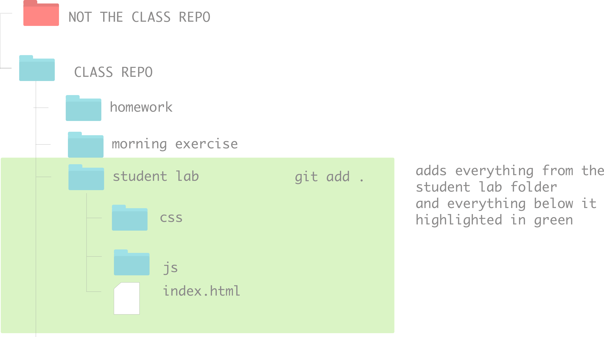

# Git & Github

Lesson |  Information
--- | --- |
**Title** | Git & Github
**Duration** | 1.5 hours
**Creator** | Kristyn Bryan
**Modified By** | Karolin Rafalski (for DSR)
**Topics** | Git & Github

## Lesson Objectives
1. What is Git?
2. What is Github?
3. How do they work together?
4. How do you make a repository?
5. How do you interact with a repo that is not yours (forking, cloning, pull requests)?

## What is git?

A version control system - a way to track changes in your computer.

Git does this for you "behind the scenes"!

## What is Github?

Github is a company that offers storage for your files. It offers a way for people to easily share their files through forking & cloning. In addition, collaboration is made possible by allowing multiple people to become collaborators on repositories.

## Who Uses It?

Companies who share their code: https://octoverse.github.com/

- Nasa:
  - https://www.nasa.gov/mission_pages/apollo/missions/apollo11.html
  - https://github.com/chrislgarry/Apollo-11
- Spotify:
  - https://github.com/zmb3/spotify
- YOU!

## Other Versioning Tools

You can read more information on this history of [file sharing from Wikipedia](https://en.wikipedia.org/wiki/File_sharing)
In the days of old, people used [FTP](https://en.wikipedia.org/wiki/File_Transfer_Protocol), [CSV](https://en.wikipedia.org/wiki/Comma-separated_values),and [SVN](https://en.wikipedia.org/wiki/Apache_Subversion).

Another popular cloud solution that is used with git, Github's competitor, is [Bitbucket](https://bitbucket.org/).

## How Do Git and Github Interact?

### Git

You work with **git** for your local tracking.

### Github

Github is a company that will store your documents "in the cloud". You can have access to your code from any machine from their company website: www.github.com or their enterprise site: https://enterprise.github.com.

**Github:** the code that you write here is public and it can be seen by all! You used this for Fundamentals and will be using it for your projects during the course.

**Github Enterprise:** this is a way for companies to own the server that their work is on save some money. The code here is private. You will be using this for your daily classwork.

### Your Part in Their Relationship

You play the most important part in this relationship. You have to tell **git** whether to track files. In addition, you can also tell **git** to send your work to **Github**.

You do all of this with **git** commands on your command line / terminal.

# Setup

For each repo, we'll follow a bunch of steps to get set up. Setup is typically fast!

## Common Git Commands

### Git Refresher
Git has some funny phrasing.

- When you want to get code onto your computer you `pull`*
- When you want to send code to github (or elsewhere on the internet) you `push`
- If you want to make a copy of a repository on your computer(also known as local/locally) it's called `cloning`
- If you want to make a copy of a repository on github and store it on your account, that's called `forking` - note: `forking` is specific to github and is *NOT* a git command

- `pull` can also mean a request for someone to pull in your code - on github you may see something called `pull requests`

When you use bash you are talking to your computer. There is a  structure to the commands you tell it.  

A git command has a minimum of 1 argument.

Git commands are always executed by first typing `git`

The first argument is the command (or verb), like
- `git init` (initialize a new git repository)
- `git push` (send the code to a remote location)

The second(+) argument gives the first argument context (when needed)
- `git add .` (add all files in this directory)
- `git pull origin master` (get all files from the url that has an alias of `origin`, from the branch `master`)

Lastly, flags can be added
- `git remote -v` (git show remote(s) and be verbose(give more detail))

Here is a table of our commonly used git commands:

| git | Argument | Flag(s)/Additional arguments | Description |
|:---:|:-----------:|:-------:|:-----------:|
| git | init |  |  Initializes a new repository|
| git | add | `.` or filename | Takes untracked files and adds them to the staging area so that they can be committed   |
| git | commit | -m 'some message'  |  Takes a snapshot of files in the staging area/ saves this version of them as a commit|
| git | remote | -v |  Shows the remote repositories associated with the local repository. Most repositories have an alias for their urls like `origin` or `upstream`|
| git | pull | upstream master |  Gets files from a url with an alias of `upstream` from its branch `master`|
| git | push | origin dev |  Sends files to a url with an alias of `origin` to its branch `dev`|
| git | log| --oneline |  Shows a log of commits of a repo (--oneline shows a truncated message)_`q` to exit_|
| git | status |  |  Shows the state of files in a repo (untracked, modified, staged)|

[Link to our wiki with a more complete list of git commands](https://github.com/ga-students/wdi-remote-matrix/wiki/Git-Cheatsheet)

Note: `fork` is not on this list because `fork` is not a git command; it is github-specific for copying a repository on github to a new location on github.

### Git VCS - Branches and Merging
Git is a VCS (Version Control System). There are a few popular ones, but git ends up being a top choice because of its branching and merging feature.

If we think back to our past projects, when we wanted to implement some major changes to our code and failed our popular options were to
- `⌘Z` throughout our files and hope for the best
- Comment out a ton of code and hope to restore the functionality of our code to a previous version
- Seriously contemplate coding out our project from scratch again
- Curl up into a ball and hope the code would revert via magic

[Git's about page has 4 great reasons why it works so well for individuals and large teams.](https://git-scm.com/about)

- Frictionless Context Switching - Switch between branches, whenever! No worries!
- Role-Based Codelines - Have many versions of your code - Production, Development, Day-to-Day etc.
- Feature Based Workflow - Create a new branch for each feature
- Disposable Experimentation - if a branch doesn't work out, you can just walk away or toss it. It has no impact on the working code

You may be thinking 'this sounds too good to be true!' It's not! But there is a catch! Git requires changing the way we are used to working on projects. Which means it takes some time and practice to learn to use git.

## Practice Making a Github Repo

### 2 Ways :octocat:

#### 1. Making a repo on Github first and cloning it locally

1. Go to your Github account and log in to your account.

2. Click on the plus sign next to your profile photo at the top-right corner of your page:

    

3. Click on `New repository`

    

4. Create a new repo by entering a name in the `Repository Name` field. Note that this name has to be *unique* to your repository. Let's use the random name that they suggested for me: `repo-practice`

    

5. This will be a **public** repo. Private repos required a paid account.

6. Click on the "Initialize this repository with a README". A README file is just a blank document that is the default page that your repository displays. It is a markdown file and normally includes information that you provide about your application.

    

7. Click `Create repository`. You should be redirected to the newly made repo.

8. Click on the `Clone or download` button.

9. Copy the link (this is the direct link that is created by Github to your repo).

    

10. Open your terminal / Git Bash - it's time to make a local copy of this Github repo!

11. In your terminal / Git Bash, navigate to the folder where you would like to keep the folder for this repo.

12. Type the git command `git clone` followed by the link to your repo.

    

13. That's it! Type `ls` to see your files. Your new repo should be there. Navigate inside the folder, type `ls` and confirm that you have a `README.md` file.

14. Go ahead and open the `README.md` in your text editor (Bonus! Do it from the command line!). You can write plain text in a markdown file. So you can send yourself a message! If you don't know what to write, go with a classic `Hello World!` , save this file.

15. In terminal type `git status`

16. `git add .` to add your file to be `staged` - this will tell git that you'd like to track this file's changes

17. `git commit -m 'my first commit'` - this will take a 'snapshot of your file' and have a message attatcched to it

18. `git push origin master` - this should send your changes to your github repo

19. Go back to the browser, refresh, you should see your updated readme!

20. Back in terminal type `git status` - it should now say there is nothing to commit

21. We can look in more detail of what we did. type `git remote -v`

this will show you the name of the remote, by default it is called `origin`. Rather than typing `https://github.com/stuff/morestuff/blahblablah` every single time you want to connect with your repo, you just type `origin` instead - less typing = working smarter, not harder!

you'll also see the branch name, by default `master`, you can have many branches and their utility is amazing! In fact it is the branching of git that makes it a top choice. But for today, we'll just work with our master branch.

#### 2. Making a local folder, turning it into a git repo, pushing it up to Github

1. Navigate to the folder where you're going to keep the files for this lesson.

GOTCHA: Do not initialize a git repository inside of another git repository, do not make your root directory a git repository - this will confuse git and you won't be able to track or even open your files.

2. Create a new folder called `git-repo-practice`.

3. Navigate inside `git-repo-practice` and type `git status` (you should get an error). We need to ask git to track this folder, so let's tell it to do so.

4. Inside this folder, run the command `git init` (this tells git to track this folder). Type `git status` to see that there is no longer an error.

5. We now have a local git repo, we have to create a repo on Github and connect it. Navigate to Github and log in if you're not logged in already.

6. Create a new Github repo. Let's give it the name `git-repo-practice` (note that this is the same as our local file, but it does not have to be for it to work).

7. **Do not** initialize a README (we'll make it on our own in our local repo).

8. Copy the repo address (it will look like: git@github.com:username/new_repo).

9. Go back to your terminal / Git Bash. We will create a remote called `origin` by running the command `git remote add origin git@github.com:username/new_repo` (replace the last part with your specific repo address). You can also name the alias something else. `origin` is the default and the convention, but if you wanted to name it `batman` it would be fine (though your coworkers may think you're a bit odd for it)

10. Confirm that you have the remote created by running the command `git remote -v`

11. Let's create a README and push it up to our Github repo. From inside our local `git-repo-practice` folder, create a file called `README.md`. (how do we create a new file in terminal?)

12. Type `git status` to see that we have a new file that needs to be committed.

13. `git add .`, `git commit -m"adding initial README file"`, `git push origin master`

14. Go back to Github and refresh your page. Your README file should now be pushed up from your local repo to your Github repo.

## Interacting with Other People's Repos

Sometimes we want to interact with another user's repo. We can safely do this by **forking** it.

**Forking** is the equivalent of making a copy to keep for ourselves.

 

## Let's Practice Together

### Part 1 - Fork It

1. Navigate to: https://git.generalassemb.ly/datr1618/your-development-environment

2. Fork this repo and add it to your personal (GHE - github enterprise) repo.

    

What it looks like on Github

    

    

3. On Github, navigate to your personal repo.

    

What it looks like on Github

    

    

    

4. On Github, navigate to your forked version of this repo (your username should be in the top left corner of the page followed by a slash and the name of the repo. Ex: `harrypotter/git-github-practice`).

## You Do! Mini Lab - Follow the steps below

### Step 2 - Clone It

5. Click on the `clone or download` button:

    

What it looks like on Github

    

    

5. Copy the web address:

    

What it looks like on Github

    

    

6. Open your git bash (terminal / Git Bash).

7. Navigate to the folder where you would keep your work for today (if your class does not have a specific file structure for you to follow, possibly make an external folder by the topic that you're learning).

8. Make a clone of your github forked repository by running the command `git clone` followed by the address of your fork (the web address that you copied in **step 5**):

    

What it looks like in your terminal / Git Bash 

    

    

NOTE: This will create a folder named the same as the repo. It should contain all of the files and folders that were located in the repo.

## Step 3 - It's Local!

9. Check it out! Type `ls` to see the files that you cloned from Github. These files are now **local**.

10. Type `git remote -v` to confirm that git has created a remote link for you. The default name is `origin` and to confirm that you're inside the right file, check the name of the repo in the remote link.

## Step 4 - Edit Locally

11. Navigate inside the repo. Find the `howdy.py` file and run it in terminal type `python howdy.py`

13. Adjust the code

1. Save your file in your text editor.

## Step 5 - Push Local Changes to Github

2. In your terminal / Git Bash, run the command `git status` to see that there is a file that has changes that need to be added and committed.

3. In your terminal, run the command `git add .` to add all of the files that need to be tracked.

    

What it looks like in your terminal

    

    

4. In your terminal / Git Bash, run the command `git commit -m" add a message here about what you did"` to commit the files.

    

What it looks like in your terminal

    

    

5. In your terminal / Git Bash, run the command `git push origin master` to push your work from your local machine to your repository on Github.

   

What it looks like in your terminal

   

   

   NOTE: `origin` here refers to the default variable name that git has assigned to your repository. `master` refers to the default branch that Github creates for you when you make a new repository.

6. Go to Github, look at your forked repo, refresh the page. Your changes should now appear in the file.

Oh wait... let's change something...

## Step 6 - Make Another Change

1. In your text editor, open the `howdy.py` file and change the string again!

2. In your terinal / Git Bash, run `git status` to see that there is a change that has been tracked.

3. Go through the process of adding, committing, and pushing your code.

4. Go back to Github and look at the pull request that you submitted. It should have our newly updated code!

## Almost done! We'll talk about Step 8 together

## Step 8 - Get Changes From Original Repo
Sometimes you want to get changes that have been made to the original repository.

1. Add a way to get that information by creating a remote to the original remote repo
  - `git remote add upstream` plus the URL of original repo
  - `upstream` is a conventional name for the original repo of a fork - you can use a different name if you'd like.

2. Type `git remote -v` to see the remotes that you have in your project. You should now have a remote for your *origin* with *your forked* link AND you should have *upstream* with *the original* repo.

3. To get any updated information from the original repo, request that git pulls the info:
 - `git pull upstream master`

Your terminal will give a message back with what has been added or deleted since you last pulled the information;

What it looks like in your terminal / Git Bash

 

  or

 

 

## Practice on Your Own

Learning git is hard! It's a pretty different way of tracking and moving files than we're used to. But practice will make it come naturally

## Final Questions?
